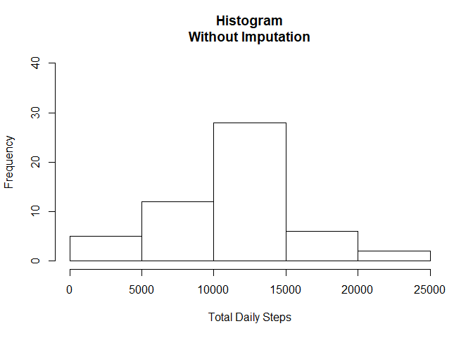
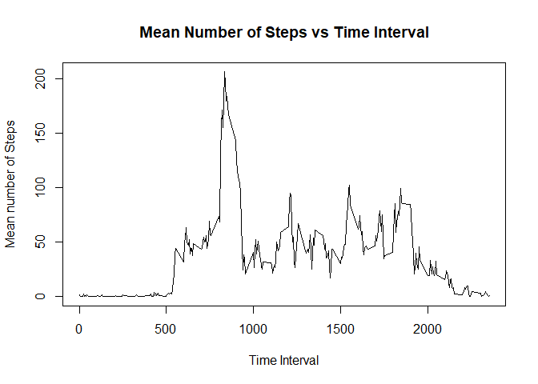
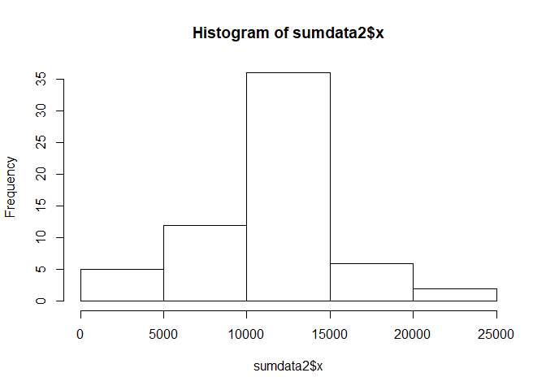
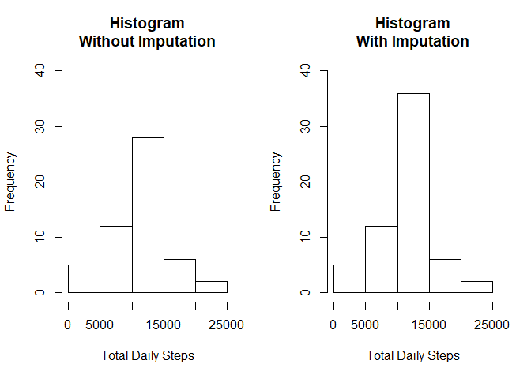
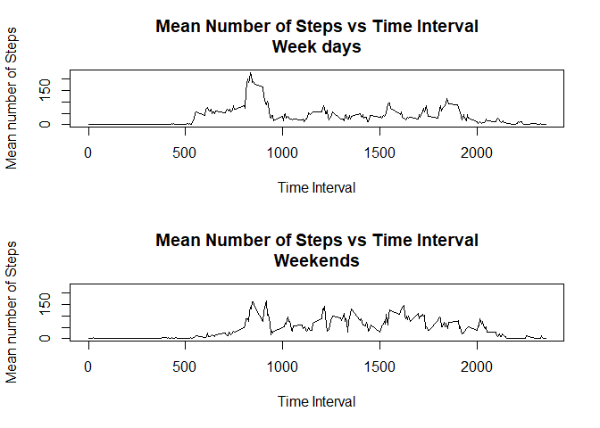

## Loading and preprocessing the data

```r
## load the library needed for obtaining weekdays
library(chron)
```

```
## Warning: package 'chron' was built under R version 3.2.5
```

```r
## Code for reading in the dataset and/or processing the data
dat = read.csv("activity.csv", header=TRUE)
head(dat)
```

```
##   steps       date interval
## 1    NA 2012-10-01        0
## 2    NA 2012-10-01        5
## 3    NA 2012-10-01       10
## 4    NA 2012-10-01       15
## 5    NA 2012-10-01       20
## 6    NA 2012-10-01       25
```

```r
summary(dat)
```

```
##      steps                date          interval     
##  Min.   :  0.00   2012-10-01:  288   Min.   :   0.0  
##  1st Qu.:  0.00   2012-10-02:  288   1st Qu.: 588.8  
##  Median :  0.00   2012-10-03:  288   Median :1177.5  
##  Mean   : 37.38   2012-10-04:  288   Mean   :1177.5  
##  3rd Qu.: 12.00   2012-10-05:  288   3rd Qu.:1766.2  
##  Max.   :806.00   2012-10-06:  288   Max.   :2355.0  
##  NA's   :2304     (Other)   :15840
```

```r
## Add the day of the week to the database
dat$wkday = weekdays(as.Date(dat$date))

## Identify the day as a weekday or weekend.
cnt = length(dat$steps)

# Initialize the day category vector
dat$day_cat = rep(NA, cnt)

# Attach the correct category to each day of the week:
for (i in 1:cnt) {
	if (dat$wkday[i]=="Saturday") 
		dat$day_cat[i]="Weekend"
	else if (dat$wkday[i]=="Sunday")
		dat$day_cat[i]="Weekend"
	else
		dat$day_cat[i]="Weekday"
}
```


## What is mean total number of steps taken per day?

```r
## The following code accomplishes the goal of
## generating a histogram of the total number of steps
## taken each day and answering the question about mean
## and median.

## Compute the total number of steps for each date
sumdata = aggregate(x=dat[,1], by = list(date=dat$date), FUN="sum")


## Create a histogram of the total number of steps per day
hist(sumdata$x, ylim=c(0,40), main = "Histogram\nWithout Imputation",
	xlab="Total Daily Steps")
```

<!-- -->

```r
## Compute the mean and median number of steps taken each day.
mean(sumdata$x, na.rm=TRUE)
```

```
## [1] 10766.19
```

```r
median(sumdata$x, na.rm=TRUE)
```

```
## [1] 10765
```


## What is the average daily activity pattern?

```r
## Time series plot of the average number of steps taken in each
## 5 minute interval averaged across all days

# Begin by making a list of the time intervals and counting how many
# there are
ints = unique(dat$interval)
n = length(ints)

# Establish a vector to hold the mean steps for each interval
mn_step = rep(NA, n)

# Compute the means for each interval
for (i in 1:n) {
	mn_step[i] = mean(dat$steps[dat$interval==ints[i]], na.rm=TRUE)
}

## Plot the mean number of steps versus the time interval
plot(ints, mn_step, type="l", xlab = "Time Interval", ylab = "Mean number of Steps",
	main = "Mean Number of Steps vs Time Interval")
```

<!-- -->

```r
## Which 5 minute interval, on average across all of the days in the dataset,
## contains the maximum number of steps?

index = which.max(mn_step)
ints[index]
```

```
## [1] 835
```
##The value of 835 corresponds to the time interval between 8:35 and 8:40 AM.
\newline

## Imputing missing values

```r
## Calculate and report the total number of missing values in the dataset
sum(is.na(dat$steps))
```

```
## [1] 2304
```

```r
## Impute a value for all missing values
# First, copy the original database
dat_imp = dat

# Build a dataframe that combines all of the mean values with interval
# to which they apply
mean_dat = data.frame(cbind(ints, mn_step))

nn = length(dat_imp$steps)

## Build the imputed dataframe 'dat_imp'.
for (i in 1:nn) {
	if (is.na(dat_imp$steps[i])) dat_imp$steps[i]=mean_dat$mn_step[mean_dat$ints==dat_imp$interval[i]]
		else dat_imp$steps[i]=dat$steps[i]
}

## Create a histogram of the total steps for each day now using the imputed database.
## Compute the total number of steps for each date
sumdata2 = aggregate(x=dat_imp[,1], by = list(date=dat_imp$date), FUN="sum")

# This is the requested histogram
hist(sumdata2$x)
```

<!-- -->

```r
# I also chose to look at the two histograms side-by-side.
par(mfrow=c(1,2))
hist(sumdata$x, ylim=c(0,40), main = "Histogram\nWithout Imputation",
	xlab="Total Daily Steps")
hist(sumdata2$x, ylim=c(0,40), main = "Histogram\nWith Imputation",
	xlab="Total Daily Steps")
```

<!-- -->

```r
## Looking at the two histograms side-by-side shows us that there are
## about 8 more observations at the mean level of total daily steps.
## The range and general shape of the distribution remain the same. 

## Compute the mean and median after imputation and compare with the
## values before imputation.

## Before imputation:
mean(sumdata$x, na.rm=TRUE)
```

```
## [1] 10766.19
```

```r
median(sumdata$x, na.rm=TRUE)
```

```
## [1] 10765
```

```r
## After imputation:
mean(sumdata2$x, na.rm=TRUE)
```

```
## [1] 10766.19
```

```r
median(sumdata2$x, na.rm=TRUE)
```

```
## [1] 10766.19
```

```r
# We see that the mean didn't change.  This was to be expected since the
# imputation strategy involved replacing the missing values with the
# means from the non-missing observations.

# The median increased very slightly (i.e. by 1.19 units).
```


## Are there differences in activity patterns between weekdays and weekends?

```r
## Are there differences in activity patterns between weekdays and
## weekends?

## Note:  The label of Weekday or Weekend was added to the dataset
## during the pre-processing illustrated at the beginning of this
## document.

## Create two subsets of the imputed dataset.
DI_weekday = dat_imp[ which(dat_imp$day_cat=="Weekday"), ]
DI_weekend = dat_imp[ which(dat_imp$day_cat=="Weekend"), ]

## Establish two panels
par(mfrow=c(2,1))

## Focus on weekdays first:
# Establish a vector to hold the mean steps for each interval
mn_step = rep(NA, n)

# Compute the means for each interval
for (i in 1:n) {
	mn_step[i] = mean(DI_weekday$steps[DI_weekday$interval==ints[i]], na.rm=TRUE)
}

maxstep=max(mn_step)

## Plot the mean number of steps versus the time interval
plot(ints, mn_step, type="l", xlab = "Time Interval", ylab = "Mean number of Steps",
	main = "Mean Number of Steps vs Time Interval\nWeek days", 
	ylim=c(0,maxstep))

## Repeat for weekends:
# Compute the means for each interval
for (i in 1:n) {
	mn_step[i] = mean(DI_weekend$steps[DI_weekend$interval==ints[i]], na.rm=TRUE)
}

## Plot the mean number of steps versus the time interval
plot(ints, mn_step, type="l", xlab = "Time Interval", ylab = "Mean number of Steps",
	main = "Mean Number of Steps vs Time Interval\nWeekends", 
	ylim=c(0,maxstep))
```

<!-- -->

```r
## Observations:
# We see that on the weekends the mean number of steps per interval doesn't
# start to increase until a higher (later) time interval.
# Additionally, the peak value is not as high on the weekends, and there
# are many other intervals during the day in which the mean number of steps
# is almost as high as for the largest peak.  For the weekdays there was
# a strong peak in the graph at around 8:30 in the morning, and no other
# interval had a mean value approaching this.
```


